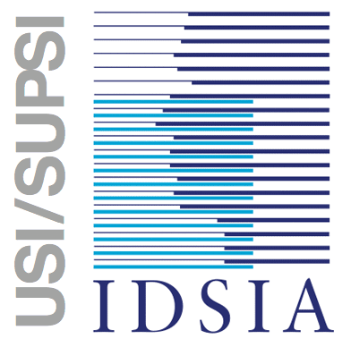

Contact and Support
======================

Credici has been developed at the Swiss AI Lab IDSIA (Istituto Dalle Molle di Studi sull'Intelligenza Artificiale).
The members of the development and research team are:

- David Huber (david@idsia.ch)

- Rafael Cabañas (rcabanas@idsia.ch)

- Alessandro Antonucci (alessandro@idsia.ch)

- Marco Zaffalon (zaffalon@idsia.ch)

- Claudio Bonesana (claudio@idsia.ch)

If you have any question, please use `Github issues <https://github.com/IDSIA/crema/issues>`_.

